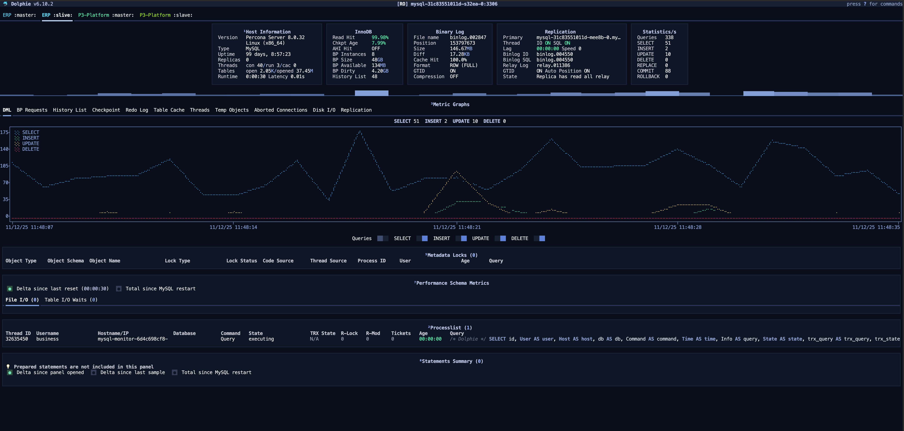

# Dolphie UI - MySQL Web 监控面板

一个基于 Docker 的 MySQL 监控 Web 界面，通过 ttyd 提供 Dolphie 的 Web 访问能力。

## 简介

Dolphie 是一个现代的 MySQL 监控工具，提供直观的终端界面实时显示 MySQL 服务器性能指标。本项目将 Dolphie 封装在 Docker 容器中，并通过 ttyd 提供 Web 访问界面，使您无需安装客户端即可在浏览器中监控 MySQL 性能。



## 功能特点

- 🚀 基于 Homebrew Ubuntu 24.04 镜像构建
- 🌐 提供 Web 界面访问，无需安装客户端
- 📊 实时监控 MySQL 性能指标
- 🔄 支持自动构建和多架构部署
- 🛠️ 提供多种部署方式：Docker、Docker Compose 和 Kubernetes
- 📝 使用配置文件管理连接参数

## 项目结构

```
dolphie-ui/
├── .github/workflows/
│   └── docker-push.yml     # CI/CD 工作流配置
├── docker/
│   ├── rds.conf           # MySQL 监控配置文件
│   └── start.sh           # Docker 启动脚本
├── docker-compose/
│   ├── docker-compose.yml # Docker Compose 配置
│   ├── rds.conf           # MySQL 监控配置文件
│   └── start.sh           # Docker Compose 启动脚本
├── kubernetes/
│   ├── deploy.sh          # Kubernetes 部署脚本
│   └── dolphie-ui.yaml    # Kubernetes 部署配置
├── .gitignore             # Git 忽略文件配置
├── Dockerfile             # Docker 镜像构建文件
├── build.sh               # 本地构建脚本
└── README.md              # 项目说明文档
```

## 快速开始

本项目提供三种部署方式：Docker、Docker Compose 和 Kubernetes。

### 方式一：使用 Docker

最简单的部署方式，适合快速测试和单机部署：

```bash
cd docker
./start.sh
```

手动启动：

```bash
docker run -d -p 7681:7681 \
  -v $(pwd)/docker/rds.conf:/home/linuxbrew/rds.conf \
  --name dolphie-ui \
  izerui/dolphie-ui \
  ttyd -p 7681 --writable -c admin:admin123 dolphie --config-file rds.conf --hostgroup rds_cluster --tab-setup
```

### 方式二：使用 Docker Compose

适合需要持久化和更多配置选项的场景：

```bash
cd docker-compose
./start.sh
```

手动启动：

```bash
docker-compose up -d
```

### 方式三：使用 Kubernetes

适合生产环境和集群部署：

```bash
cd kubernetes
./deploy.sh
```

手动部署：

```bash
kubectl apply -f dolphie-ui.yaml
```

## 访问方式

部署成功后，您可以通过以下方式访问：

- Docker/Docker Compose: http://localhost:7681
- Kubernetes: https://dolphie-ui.yourdomain.com (取决于您的 Ingress 配置)

登录凭据：
- 用户名: admin
- 密码: admin123

## 配置说明

### MySQL 连接配置

配置文件 `rds.conf` 包含以下主要部分：

1. **全局设置** `[dolphie]`：定义 Dolphie 的全局行为
2. **凭据配置** `[credential_profile_mysql_creds]`：定义 MySQL 连接凭据
3. **主机组配置** `[rds_cluster]`：定义要监控的 MySQL 实例

示例配置：

```ini
# 凭据配置文件
[credential_profile_mysql_creds]
user = your_username
password = your_password

# 主机组配置
[rds_cluster]
1={"host": "192.168.10.10", "port": 3306, "tab_title": "[cyan]ERP[/cyan] :master:", "credential_profile": "mysql_creds"}
2={"host": "192.168.10.11", "port": 3306, "tab_title": "[bright_cyan]ERP[/bright_cyan] :slave:", "credential_profile": "mysql_creds"}
```

### 启动参数

Dolphie 支持以下常用参数：

- `--config-file`: 指定配置文件路径
- `--hostgroup`: 指定要监控的主机组
- `--tab-setup`: 初始设置的标签页

## Docker 镜像信息

- 基础镜像: homebrew/ubuntu24.04
- 镜像名称: izerui/dolphie-ui
- 暴露端口: 7681
- 时区设置: Asia/Shanghai


## 相关链接

- [Dolphie 官方仓库](https://github.com/chanzuckerberg/dolphie)
- [ttyd 官方仓库](https://github.com/tsl0922/ttyd)
- [Docker Hub 镜像](https://hub.docker.com/r/izerui/dolphie-ui)

## 许可证

本项目采用 MIT 许可证 - 查看 [LICENSE](LICENSE) 文件了解详情。